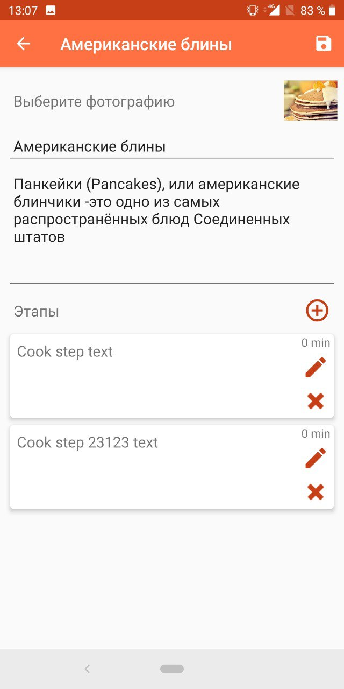

# Student Food Android

**Student Food** - simple Java Android application for adding, storing and editing cook recipes. Based on MVP architecture using [Mosby MVP library](http://hannesdorfmann.com/mosby/) and [Paper database](https://github.com/pilgr/Paper) for storing. 

## Screenshots

  
  
  

## Used libraries
-   [AppCompat, CardView, RecyclerView](http://developer.android.com/intl/tools/support-library/index.html)
-   [MosbyMVP](http://hannesdorfmann.com/mosby/)
-   [EventBus](https://github.com/greenrobot/EventBus)
-   [Paper](https://github.com/pilgr/Paper)
-   [Image picker](https://github.com/esafirm/android-image-picker)

If you have questions or need more information, welcome :3
   
